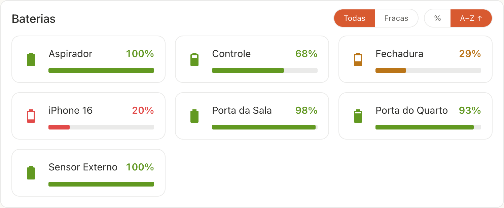
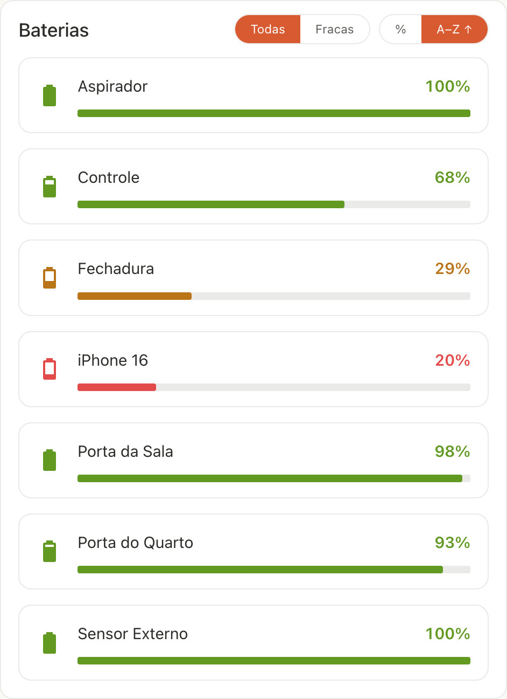

# Battery Card

A Home Assistant **Lovelace custom card** (`custom:battery-card`) that
**auto-discovers every `battery` device-class sensor** and shows each one as its
own tile — **weakest first** — highlighting the low ones. No manual entity list
and **no custom integration**: it is a single-file, zero-build frontend resource.





## Features

- **Auto-discovery** — finds every `sensor` with `device_class: battery`; no
  entity list to maintain (you can still pass an explicit `entities` list to
  override it).
- **Tile grid** — one tile per battery, in a responsive grid with a configurable
  **max number of columns** per row.
- **Weakest-first** — sorted by level by default; in-card toggle to sort by
  **level** or **name** and to flip the direction.
- **Filter** — show **all** batteries or **only the low** ones, from the config
  and from an in-card toggle.
- **Low / warning thresholds** — configurable; low batteries are colored with
  the theme's error color, warning ones with the warning color.
- **Device names** — prefers the device name (and your rename) over the raw
  battery entity's friendly name.
- **Theme-aware** — pure Home Assistant **design tokens**, so it follows the
  active theme and light/dark mode automatically.
- **Visual editor** — full options UI in the dashboard.
- **Localized** — English and Brazilian Portuguese, following the active Home
  Assistant UI language (falls back to English).

## Installation

### Manual

1. Copy `battery-card.js` into your Home Assistant `config/www/` folder.
2. Register it as a Lovelace resource — *Settings → Dashboards → ⋮ → Resources
   → Add resource*:
   - URL: `/local/battery-card.js`
   - Type: **JavaScript Module**
3. Restart Home Assistant (needed the first time you add a `www/` file).

### HACS (custom repository)

Add this repository as a **custom repository** of category **Dashboard**, install
it, then reload resources.

## Usage

Add the card to any dashboard. With auto-discovery, the minimal config is just:

```yaml
type: custom:battery-card
```

All options:

```yaml
type: custom:battery-card
title: Baterias        # optional; defaults to a localized "Batteries"/"Baterias"
mode: all              # all | low            (default all)
sort: level            # level | name         (default level)
sort_direction: asc    # asc | desc           (default asc)
threshold: 20          # % at/below which a battery is "low"     (default 20)
warning: 40            # % at/below which a battery is "warning"  (default threshold*2)
columns: 5             # max tiles per row on wide screens        (default 5)
entities:              # optional — overrides auto-discovery
  - sensor.some_battery
```

## Options

| Name             | Type                | Default          | Description                                                        |
| ---------------- | ------------------- | ---------------- | ------------------------------------------------------------------ |
| `title`          | string              | localized        | Card header. Defaults to a localized "Batteries" / "Baterias".     |
| `mode`           | `all` \| `low`      | `all`            | Show every battery, or only the ones at/below `threshold`.         |
| `sort`           | `level` \| `name`   | `level`          | Sort by percentage or by name.                                     |
| `sort_direction` | `asc` \| `desc`     | `asc`            | Ascending (weakest / A→Z first) or descending.                     |
| `threshold`      | number              | `20`             | Percentage at/below which a battery counts as **low**.             |
| `warning`        | number              | `threshold * 2`  | Percentage at/below which a battery counts as **warning**.         |
| `columns`        | number (1–12)       | `5`              | Max tiles per row on wide screens; degrades to fewer as width drops. |
| `entities`       | list                | auto-discovery   | Explicit entity list; overrides auto-discovery.                    |

The `mode`, `sort` and `sort_direction` options are also togglable directly on
the card. A visual editor is available in the dashboard UI, so YAML is optional.

## Development

Single file, zero-build (vanilla `HTMLElement`, no Lit/bundler). Edit
`battery-card.js` directly. Releases are automated with
[release-please](https://github.com/googleapis/release-please); commit with
[Conventional Commits](https://www.conventionalcommits.org/) messages.

## License

[MIT](LICENSE)
